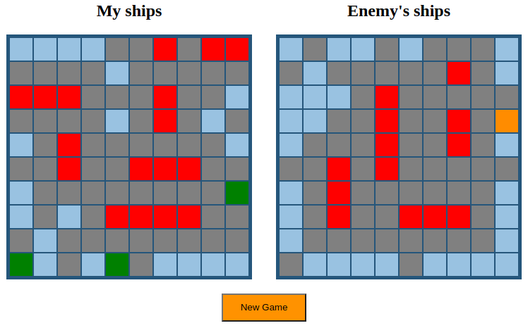

# Sea Battle

## About
The main goal of the game is to kill all enemy's ships before the enemy kills yours.




## Description
Originally I wrote this project on PHP 5.6 in 2016, but now I rewrote it on PHP 8.

I didn't use any frameworks, libraries or anything else, just pure PHP.

## AI
I wrote 3 algorithms:
1) RandomAI - just shooting randomly without trying to kill damaged ships.
2) ImprovedRandomAI - shooting randomly, but when ship is damaged, AI is trying to kill it.
3) SmartAI - a little bit more complicated than ImprovedRandomAI, but it's working better.

## How to

### 1) Change AI
```php
// src/Game.php

public function startNewGame(): void
{
    $this->enemyPlayer = new EnemyPlayer(new AI\SmartAI());
    // $this->enemyPlayer = new EnemyPlayer(new AI\RandomAI());
    // $this->enemyPlayer = new EnemyPlayer(new AI\ImprovedRandomAI());
}
```

### 2) Change boards sizes
```php
// src/Board/AbstractBoard.php

public const WIDTH = 10;
public const HEIGHT = 10;

```

### 3) Change ships on board
```php
// src/Board/ShipBoard.php

public const SHIPS_TO_CREATE = [
    ["ship size" => 4, "number" => 1],
    ["ship size" => 3, "number" => 2],
    ["ship size" => 2, "number" => 3],
    ["ship size" => 1, "number" => 4],
];
```

## How to run the project

```shell
git clone https://github.com/PavelGushchin/seabattle.git
cd seabattle
composer update
php -S localhost:8080 -t public
```
After that, open `http://localhost:8080` in your browser. 
